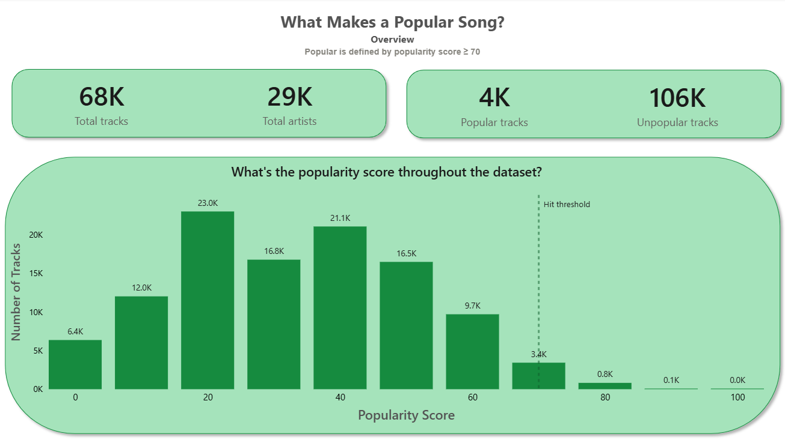
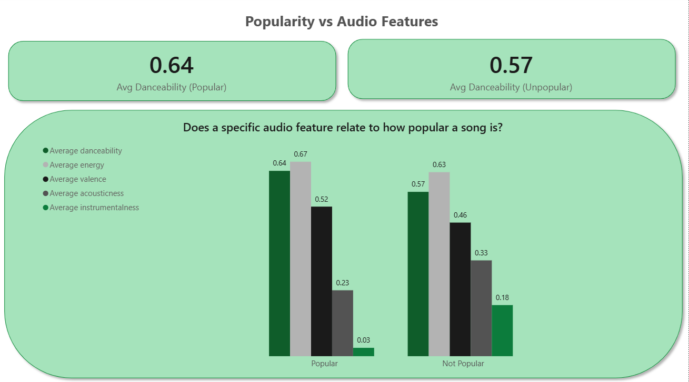
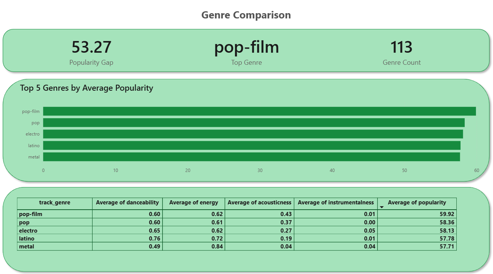
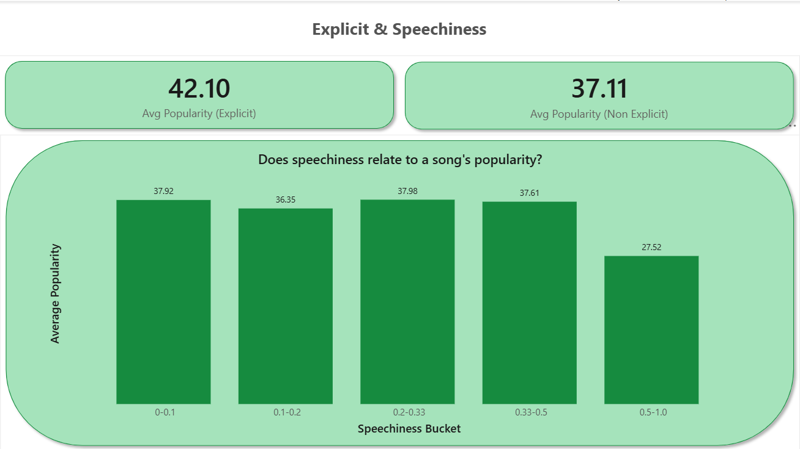

# Introduction
📊 What actually makes a song popular on Spotify? This project digs into 🎧 the audio features that separate hits from the rest, 🎼 which genres consistently outperform, and 🗣️ whether explicit content or spoken-word tracks move the needle on popularity.

🔍 The full Power BI file is in [spotify project.pbix](/spotify project.pbix).

# Background
This project uses the [Spotify Tracks Dataset](https://www.kaggle.com/datasets/maharshipandya/-spotify-tracks-dataset) (Kaggle) — 114,000 tracks across 114 genres, with popularity scores, 9 audio features, genre, and explicit flags. The raw dataset is included in this repo as [spotify-tracks-dataset-detailed.csv](/spotify-tracks-dataset-detailed.csv).

I wanted to go beyond a single chart and actually investigate the question from a few different angles: audio characteristics, genre, and content type — and be honest about what the data does and doesn't support along the way.

### Questions this project set out to answer:

1. What does the overall popularity landscape of the dataset look like, and where's the line between "popular" and "not"?
2. Does a specific audio feature (danceability, energy, valence, acousticness, instrumentalness) relate to how popular a song is?
3. Are some genres associated with more popular songs than others?
4. Do explicit content and speechiness relate to a song's popularity?

# Tools I Used
- **Power BI** to build the interactive dashboard.
- **DAX** for custom measures, calculated columns, and sort logic.
- **Power Query** for basic data shaping.

# The Analysis

### 1. Overview
**Question:** What does the popularity landscape look like, and what threshold defines "popular"?



```dax
Popularity Tier = IF(SELECTEDVALUE('Spotify'[popularity]) >= 70, "Popular", "Not Popular")
```

| Metric | Value |
|---|---:|
| Total tracks | 114,000 |
| Total artists | ~28,500 |
| Popular tracks (score ≥ 70) | 5,472 (4.8%) |
| Not popular tracks | 108,528 |

- The distribution is **right-skewed** — most tracks sit in the 10–50 range, with a sharp drop-off past 60.
- Defining "popular" as the top ~5% (score ≥ 70) gives a clear, defensible baseline for the rest of the report rather than an arbitrary cutoff.
- This threshold is carried through every other page as the Popular / Not Popular split.

### 2. Popularity vs Audio Features
**Question:** Does a specific audio feature relate to how popular a song is?



```dax
Avg Danceability (Popular) = 
CALCULATE(AVERAGE('Spotify'[danceability]), 'Spotify'[Popularity Tier] = "Popular")
```

| Feature | Popular | Not Popular |
|---|---:|---:|
| Danceability | 0.64 | 0.57 |
| Energy | 0.67 | 0.63 |
| Valence | 0.52 | 0.46 |
| Acousticness | 0.23 | 0.33 |
| Instrumentalness | 0.03 | 0.18 |

- Popular tracks skew **more danceable, energetic, and upbeat (valence)**, and noticeably **less acoustic and instrumental**.
- Worth being precise about the claim here: these are **group averages**, not a correlation test — a large average gap (like instrumentalness, 0.03 vs 0.18) doesn't by itself prove a strong linear relationship across all 114,000 tracks. I checked this directly and found the actual point-by-point correlations between each feature and popularity are all weak (roughly -0.10 to +0.04), meaning none of these features move consistently with popularity on their own — the average gap is real, but it's likely shaped by other factors (genre, artist reach) more than the audio feature itself.

### 3. Genre Comparison
**Question:** Are some genres associated with more popular songs than others?



```dax
Popularity Gap = 
MAXX(VALUES('Spotify'[track_genre]), CALCULATE(AVERAGE('Spotify'[popularity]))) -
MINX(VALUES('Spotify'[track_genre]), CALCULATE(AVERAGE('Spotify'[popularity])))
```

| Genre | Avg Danceability | Avg Energy | Avg Acousticness | Avg Instrumentalness | Avg Popularity |
|---|---:|---:|---:|---:|---:|
| pop-film | 0.60 | 0.62 | 0.43 | 0.01 | 59.92 |
| pop | 0.60 | 0.61 | 0.37 | 0.00 | 58.36 |
| electro | 0.65 | 0.62 | 0.27 | 0.05 | 58.13 |
| latino | 0.76 | 0.72 | 0.19 | 0.01 | 57.78 |
| metal | 0.49 | 0.84 | 0.04 | 0.04 | 57.71 |

- **pop-film is the top genre** by average popularity, out of 114 genres tracked.
- There's a **53-point popularity gap** between the top and bottom genres — genre alone accounts for a wide spread in average performance.
- Pairing the ranking with an audio-profile table shows genre and audio features interact rather than one variable explaining the other — e.g. metal is high-energy/low-acousticness but doesn't top the list, while latino tops both danceability and popularity together.

### 4. Explicit & Speechiness
**Question:** Do explicit content and speechiness relate to a song's popularity?



```dax
Speechiness Bucket Sort = 
SWITCH(
    TRUE(),
    'Spotify'[speechiness] < 0.1, 1,
    'Spotify'[speechiness] < 0.2, 2,
    'Spotify'[speechiness] < 0.33, 3,
    'Spotify'[speechiness] < 0.5, 4,
    5
)
```

| Speechiness Bucket | Avg Popularity |
|---|---:|
| 0–0.1 | 37.92 |
| 0.1–0.2 | 36.35 |
| 0.2–0.33 | 37.98 |
| 0.33–0.5 | 37.61 |
| 0.5–1.0 | 27.52 |

- **Explicit tracks average 42.1** popularity vs **37.1** for non-explicit tracks — a modest but consistent gap.
- Popularity holds **flat around 36–38** across the first four speechiness buckets, then **drops to 27.5** in the 0.5–1.0 bucket — meaning it's not speechiness itself that hurts popularity, but specifically the extreme, mostly-spoken-word end of it (podcasts, skits, heavy spoken samples).

# What I Learned
- Practiced translating a vague question ("what makes a song popular?") into a set of concrete, page-by-page sub-questions before building anything.
- Learned the difference between a **group-average comparison** and a **correlation** — and that a dashboard can accidentally overstate a finding if it only shows the former. Checking the real correlation coefficients before writing any conclusion changed how I phrased the audio-features page.
- Got hands-on with DAX beyond basic aggregations — `SWITCH(TRUE(), ...)` for custom bucketing and sort-order columns, and `MAXX`/`MINX` over `VALUES()` for a genre-level min/max gap rather than a row-level one.
- Learned that a sort-by column is required (not optional) whenever a text-based bucket needs to display in a non-alphabetical, logical order — otherwise the pattern in the data gets hidden by the display order.

# Conclusions

### Insights
1. **Popularity is concentrated at the top:** only ~4.8% of tracks clear the "popular" (≥70) threshold, and the distribution is sharply right-skewed.
2. **Audio features show average differences, not strong individual correlations:** popular tracks are more danceable and energetic on average, but no single audio feature moves consistently with popularity across the full dataset (correlations are all weak).
3. **Genre matters more decisively:** a 53-point popularity gap separates the top and bottom genres, with pop-film leading.
4. **Content type has a real, specific effect:** explicit tracks slightly outperform non-explicit ones, and heavily spoken-word content is a clear negative outlier — not speechiness in general.

### Closing Thoughts
The biggest shift in how I think about this project came from checking my own numbers before trusting them — the "audio features" story looked much stronger in bar-chart-average form than it did once correlation coefficients were actually computed. That gap between what a chart *implies* and what the underlying statistic *supports* was the most useful thing this project taught me, and it changed how I'll phrase findings going forward. Credit to the dataset's original compiler (linked above) for the data this project is built on — the dashboard, DAX, and analysis here are my own.
